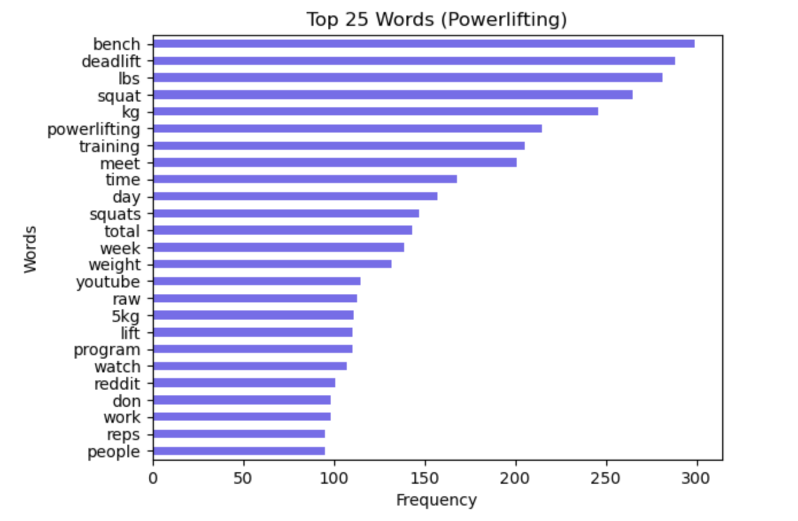
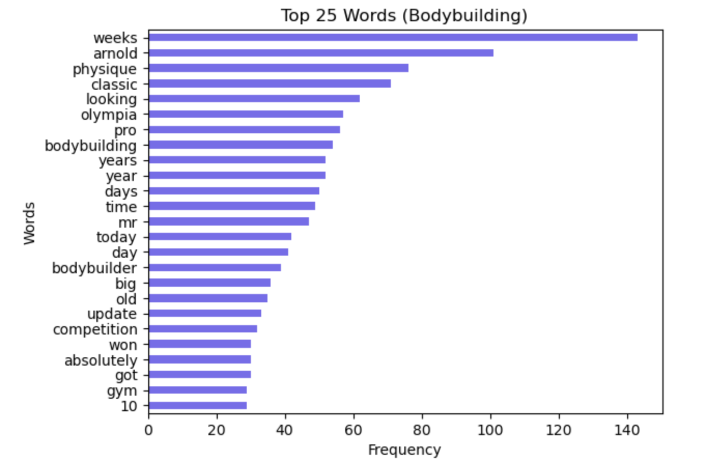
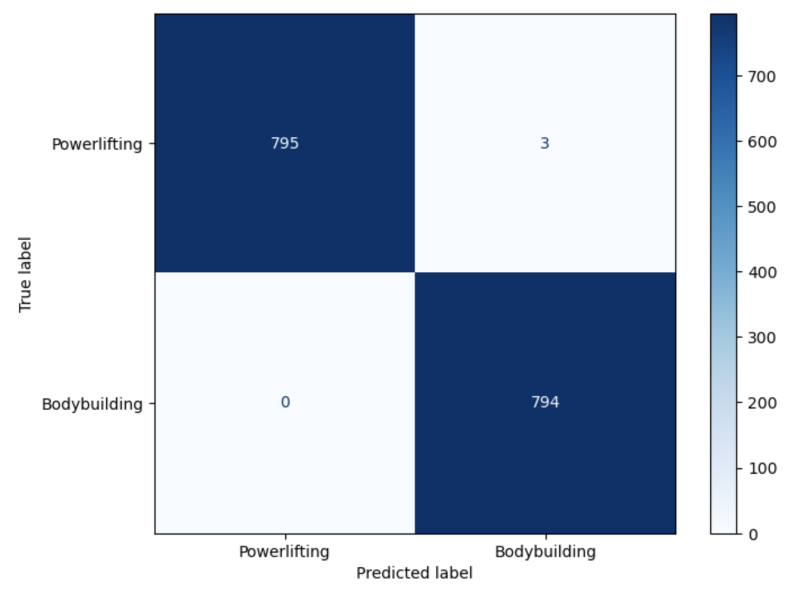
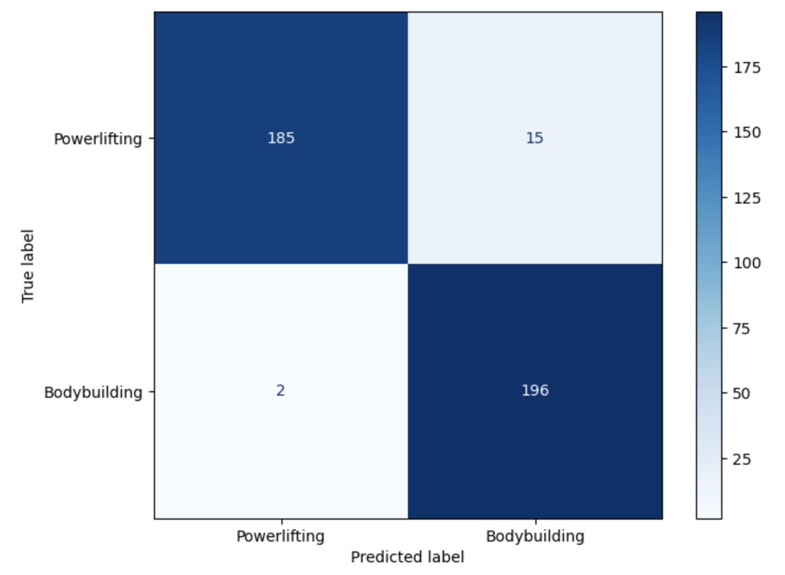

# Project 3: Reddit Classification: Powerlifting vs. Bodybuilding

# Problem Statement
A new local gym called Global Fitness wants to host powerlifting and bodybuilding events to attract more long-term customers and increase gym membership sales. In order to properly advertise to powerlifters and bodybuilders for their respective competitions, the marketing team at Global Fitness is looking at subreddits for powerlifting and bodybuilding to understand the nuances of each topic. However, because there are so many posts, they are looking for a data scientist to figure out the best ways to utilize these subreddits for marketing purposes.

# Executive Summary
This project utilizes several different models with and without the tuning of hyperparameters to classify posts of two separate subreddits (r/powerlifting and r/bodybuilding) to the proper subreddit by using natural language processing. To do this, data was collected from roughly the top 1000 posts of all time from each subreddit via the Reddit API, dataframes were created for each subreddit and converted to CSV files, datasets were then cleaned, features were engineered, and all of the data was combined into one dataset. Then exploratory data analysis was conducted and several different models were created and evaluated. The models that performed the best were the Logistic Regression and Random Forest models with CountVectorizer and a grid search for tuning hyperparameters. The train score was 99.8% and the test score was 95.7% for the Logistic Regression model and similar scores were seen in the Random Forest model. The words that held the most weight were discovered and recommendations were made to Global Fitness in order to best advertise to powerlifters and bodybuilders.

# Table of Contents:
- [Project Title](#Project-3:-Reddit-Classification:-Powerlifting-vs.-Bodybuilding)
- [Problem Statement](#Problem-Statement)
- [Executive Summary](#Executive-Summary)
- [Data Dictionary](#Data-Dictionary)
- [Visualizations](#Visualizations)
- [Results](#Results)
- [Conclusions and Recommendations](#Conclusions-and-Recommendations)
- [Limitations and Future Studies](#Limitations-and-Future-Studies)
- [Sources](#Sources)

# Data Dictionary

The data used in this project comes from Reddit. Please see the Python Reddit API Wrapper Documentation (https://praw.readthedocs.io/en/stable/index.html) for a more detailed look into accessing the Reddit API.

|Feature|Type|Dataset|Description|
|---|---|---|---|
|id|object|powerlifting_bodybuilding.csv|ID number of post|
|created_utc|float|powerlifting_bodybuilding.csv|Time post was created|
|title|object|powerlifting_bodybuilding.csv|Title of post|
|self_text|object|powerlifting_bodybuilding.csv|Body of post|
|subreddit|int|powerlifting_bodybuilding.csv|r/powerlifting (1) or r/bodybuilding (2)|
|all_text|object|powerlifting_bodybuilding.csv|title and self_text columns combined|

**Datasets**
- powerlifting.csv: Dataset containing only powerlifting data pulled from Reddit.
- bodybuilding.csv: Dataset containing only bodybuilding data pulled from Reddit.
- powerlifting_bodybuilding.csv: Dataset containing both powerlifting and bodybuilding data.
- subreddit_all_text.csv: Dataset containing only the subreddit and the all_text columns.

# Visualizations

Confusion Matrix Results (Training Data)

Confusion Matrix Results (Testing Data)

# Results
- LogisticRegression with CountVectorizer and GridSearchCV Train Accuracy Score: 0.9981155778894473
- LogisticRegression with CountVectorizer and GridSearchCV Test Accuracy Score: 0.957286432160804
- RandomForest with CountVectorizer and GridSearchCV Train Accuracy Score: 0.9981155778894473
- RandomForest with CountVectorizer and GridSearchCV Test Accuracy Score: 0.9623115577889447

# Conclusions and Recommendations
- Words that held the most weight for Powerlifting:
    - “deadlift”
    - “squat”
    - “pulls”
    - “squats”
    - “bench”
- Words that held the most weight for Bodybuilding:
    - “weeks”
    - “arnold”
    - “olympia”
    - “physique”
    - “looking”
- Recommend Global Fitness to use those words and their associations in any form of advertising media to attract powerlifters and bodybuilders to their respective events.

# Limitations and Future Studies
- Most models showed a little bit of overfitting as the training data tended to usually score higher than the testing data.
- Future studies should involve further modification of the training set and continued regularization of the models for less overfit results.
- Most of the baseline models scored fairly high in terms of accuracy without tuning hyperparameters. This could be due to the fact that the two subreddits are already quite distinct and that the members of each subreddit community make posts specific to their respective topics with little overlap.
- Looking at other sources of data outside of Reddit would be valuable, especially when targeting new customers.

# Sources
- Reddit API PRAW Documentation: https://praw.readthedocs.io/en/stable/index.html
- Powerlifting subreddit: https://www.reddit.com/r/powerlifting/top/?t=all
- Bodybuilding subreddit: https://www.reddit.com/r/bodybuilding/top/?t=all